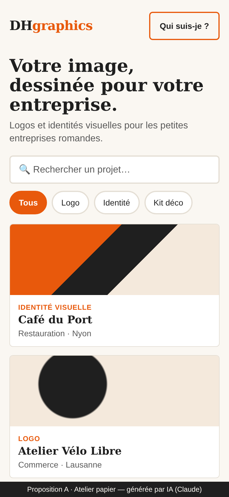
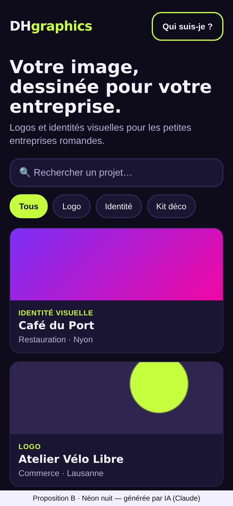
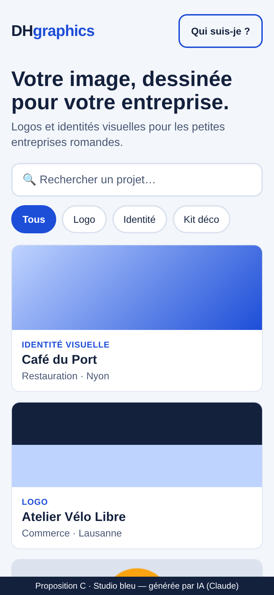

# Critique comparative — propositions de design IA

**Projet :** DHgraphics · **Écran comparé :** Accueil & Exploration (mobile 390 px)
**Outil IA utilisé :** Claude (Anthropic) — 3 directions artistiques générées à partir du [brief](../brief.md) et des [wireframes](./wireframes/).
**Images archivées :** [`propositions/`](./propositions/)

| A · Atelier papier | B · Néon nuit | C · Studio bleu |
|:---:|:---:|:---:|
|  |  |  |

## Direction artistique recherchée (rappel du brief)

Professionnelle, créative, accessible — *comme un carnet de croquis bien rangé posé sur une table d'atelier*. Le persona (Enzo, 26 ans, food truck) doit se sentir **en confiance** et **pas intimidé**.

## Grille de critères

Notes de 1 (faible) à 5 (excellent).

| Critère | A · Atelier papier | B · Néon nuit | C · Studio bleu |
|---------|:---:|:---:|:---:|
| Respect de la direction artistique du brief | 5 | 2 | 3 |
| Lisibilité sur mobile (taille, hiérarchie) | 4 | 4 | 5 |
| Contraste WCAG AA (≥ 4,5:1) | 3 | 5 | 5 |
| Adapté au persona (petit commerce, non initié) | 5 | 2 | 4 |
| Originalité / identité de graphiste | 5 | 4 | 2 |
| Mise en valeur des réalisations (images) | 4 | 3 | 4 |
| **Total / 30** | **26** | **20** | **23** |

## Analyse par proposition

### A · Atelier papier
- ✅ Fond papier chaud, titres à empattement et orange de marque : on sent un **atelier de graphiste**, pas une agence froide.
- ✅ L'orange « DH » renforce la marque et guide l'œil vers les actions (puce active, bouton « Qui suis-je ? »).
- ❌ L'orange `#E8590C` avec du texte blanc n'atteint que **3,58:1** → **échoue WCAG AA** pour du texte de taille normale.
- ❌ Les titres serif très gras prennent beaucoup de hauteur : moins de cartes visibles sans défiler.

### B · Néon nuit
- ✅ Contrastes excellents (texte 17,3:1, lime sur fond 14,9:1), très moderne.
- ❌ Ambiance « boîte de nuit / gaming » **éloignée du brief** et du persona : un artisan ou un restaurateur ne s'y reconnaît pas.
- ❌ Le fond très sombre écrase les réalisations claires et rend les vraies couleurs des logos moins fidèles.

### C · Studio bleu
- ✅ Très propre, lisible, tous les contrastes passent (bouton blanc sur bleu 6,7:1).
- ✅ Inspire la confiance (codes visuels d'un service sérieux).
- ❌ Trop **générique** : ressemble à une banque ou une application SaaS, pas au portfolio d'un créatif.
- ❌ N'exprime pas la personnalité de DHgraphics.

## Choix final : **Proposition A · Atelier papier** (avec corrections)

C'est la seule proposition qui respecte la direction artistique du brief et qui parle au persona. Ses défauts sont corrigeables sans changer l'ambiance :

1. **Accent assombri** : `#E8590C` → `#C2410C` (texte blanc sur accent **5,18:1**, accent sur fond papier **4,85:1**) → conforme WCAG AA.
2. **Titres** : taille du titre principal réduite de 30 px à 26 px pour afficher davantage de cartes au premier écran.
3. **Emprunt à C** : rayon d'arrondi légèrement plus grand (10 px) et ombre douce sur les cartes pour plus de clarté.

### Palette retenue

| Rôle | Couleur | Hex |
|------|---------|-----|
| Fond | Blanc papier | `#FAF7F2` |
| Surface (cartes) | Blanc | `#FFFFFF` |
| Texte | Noir anthracite | `#1F1F1F` |
| Texte secondaire | Gris foncé | `#5A5A5A` |
| Accent | Orange brûlé DH | `#C2410C` |
| Erreur | Rouge brique | `#B42318` |
