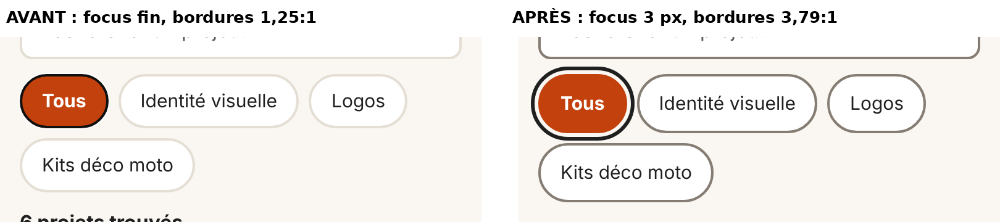

# Tests utilisateurs & audit d'accessibilité — DHgraphics

**Atelier :** e2-7 · Module ICT 291
**Support testé :** maquette cliquable du design final → [`design/maquette/index.html`](./maquette/index.html) (à ouvrir dans un navigateur, largeur mobile 390 px)
**Référence :** WCAG 2.2 niveau AA

---

## Partie A — Audit d'accessibilité

### A1. Contrastes des textes (WCAG 1.4.3 : ≥ 4,5:1, ≥ 3:1 pour les titres ≥ 24 px)

Mesures faites sur la palette du design final (formule de luminance relative WCAG, la même que celle des vérificateurs en ligne).

| Élément | Couleur texte | Fond | Ratio mesuré | Seuil | Résultat |
|---------|---------------|------|:---:|:---:|:---:|
| **Bouton principal « Demander un devis » / « Envoyer »** | `#FFFFFF` | `#C2410C` | **5,18:1** | 4,5:1 | ✅ |
| Puce de filtre active (« Tous ») | `#FFFFFF` | `#C2410C` | 5,18:1 | 4,5:1 | ✅ |
| Texte principal | `#1F1F1F` | `#FAF7F2` | 15,42:1 | 4,5:1 | ✅ |
| Texte principal sur carte | `#1F1F1F` | `#FFFFFF` | 16,48:1 | 4,5:1 | ✅ |
| Texte secondaire (sous-titre, lieu) | `#5A5A5A` | `#FAF7F2` | 6,45:1 | 4,5:1 | ✅ |
| Texte secondaire sur carte | `#5A5A5A` | `#FFFFFF` | 6,90:1 | 4,5:1 | ✅ |
| Étiquette de catégorie (13 px, orange) | `#C2410C` | `#FFFFFF` | 5,18:1 | 4,5:1 | ✅ |
| « graphics » du logo (22 px gras) | `#C2410C` | `#FAF7F2` | 4,85:1 | 3:1 | ✅ |
| Message d'erreur | `#B42318` | `#FAF7F2` | 6,15:1 | 4,5:1 | ✅ |

> Rappel : l'orange d'origine de la proposition A (`#E8590C`) ne donnait que **3,58:1** avec du texte blanc. Il a été assombri en `#C2410C` lors du choix final (voir [`critique.md`](./critique.md)).

### A2. Contrastes des contours de champs et de boutons (WCAG 1.4.11 : ≥ 3:1)

| Élément | Avant | Après correction |
|---------|-------|------------------|
| Bordure du champ de recherche | `#E4DED4` → **1,25:1** ❌ | `#857D73` → **3,79:1** ✅ |
| Bordure des puces de filtres inactives | `#E4DED4` → **1,25:1** ❌ | `#857D73` → **3,79:1** ✅ |
| Bordure des champs du formulaire de devis | `#E4DED4` → **1,25:1** ❌ | `#857D73` → **3,79:1** ✅ |

### A3. Navigation complète au clavier (Tab, Maj + Tab, Entrée, Espace)

| Vérification | Résultat |
|--------------|----------|
| Ordre de tabulation sur l'accueil : *Aller au contenu → Logo → Qui suis-je ? → Recherche → 4 puces → cartes* | ✅ logique, de haut en bas |
| Lien d'évitement « Aller au contenu » visible au premier Tab | ✅ |
| Activer une puce avec **Entrée** ou **Espace** | ✅ (« Kits déco moto » → « 2 projets trouvés ») |
| Ouvrir une carte avec **Entrée** | ✅ la fiche s'ouvre et le focus va sur son titre |
| « Demander un devis » avec **Entrée** | ✅ ouvre le formulaire |
| Envoyer le formulaire vide | ✅ 3 messages d'erreur clairs, focus placé sur le premier champ en erreur |
| Envoyer le formulaire rempli | ✅ message « Merci … ! Demande envoyée », focus placé sur la confirmation |
| Aucun piège de focus | ✅ |
| **Indicateur de focus visible** (WCAG 2.4.7) | ❌ avant : seulement le contour fin par défaut du navigateur (1 px), presque invisible sur la puce orange → ✅ après : contour **3 px noir anthracite** décalé de 3 px (15,42:1 sur le fond) |

### A4. Cibles tactiles (WCAG 2.5.8 : ≥ 24 × 24 px · standard du cours : 48 × 48 px)

| Élément | Avant | Après |
|---------|-------|-------|
| Puces de filtres | 44 px de haut ⚠️ (OK WCAG, mais < 48 px) | **48 px** ✅ |
| Bouton « Qui suis-je ? », logo, recherche, liens retour | 48 px | 48 px ✅ |
| Boutons principaux (« Demander un devis », « Envoyer ») | 52 px | 52 px ✅ |
| Cartes de projets | 358 × 212 px | ✅ |

### A5. Textes alternatifs et structure

- ✅ Chaque aperçu de projet a une description (`role="img"` + `aria-label="Aperçu du projet …"`).
- ✅ Champs du formulaire reliés à leur `<label>`, erreurs reliées au champ avec `aria-describedby` et `aria-invalid`.
- ✅ Compteur de résultats annoncé aux lecteurs d'écran (`aria-live="polite"`), puces avec `aria-pressed`.
- ✅ Langue de la page déclarée (`lang="fr"`), HTML sémantique (`header`, `main`, `section`, `ul`, `dl`).

### A6. Bug découvert pendant l'audit

Le message de succès (✓ « Demande envoyée ») et le bloc « Aucun projet » s'affichaient **alors qu'ils devaient être cachés**, parce que `display: grid` écrasait l'attribut `hidden`. → **Corrigé** avec la règle `[hidden] { display: none !important; }`.

---

## Partie B — Test utilisateur en binôme croisé

### Scénario (1 phrase, dit au testeur)

> « Vous lancez votre food truck : trouvez un projet d'identité visuelle réalisé pour un restaurant, consultez sa fiche, puis envoyez une demande de devis. »

### Protocole

- Maquette ouverte sur téléphone (ou navigateur en largeur 390 px), chronomètre de **5 minutes**.
- Observateur **silencieux** : ne pas guider, ne pas pointer l'écran, ne pas justifier. C'est l'interface qui est testée, pas la personne.
- Le testeur pense à voix haute (*Think Aloud*).

### Fiche d'observation — e2-7

**App testée :** DHgraphics (maquette cliquable)
**Testeur :** _à compléter (prénom du camarade)_
**Observateur :** Dany Henzer
**Tâche donnée :** trouver une identité visuelle pour un restaurant, ouvrir la fiche et demander un devis

#### Test 5 secondes

*(Montrer l'accueil 5 secondes, puis cacher l'écran.)*

« C'est une appli pour… » (phrase du testeur) : _à compléter_

Écart avec l'intention (« vitrine d'un graphiste pour petites entreprises ») : _à compléter_

#### Test de localisation (sur image — une tâche)

Consigne dite : « Montrez où vous tapoteriez pour : **demander un devis pour ce projet** » *(sur la fiche « Café du Port »)*

Le doigt est allé au **bon** contrôle : _oui / non / à côté_
Hésitation : _à compléter_
Dit à voix haute : _à compléter_
J'ai aidé : _oui / non_

#### Déroulé de la tâche complète

| Mesure | Observation |
|--------|-------------|
| Temps pour accomplir la tâche | _… min … s (objectif < 90 s)_ |
| Hésitations observées (regard perdu, clics infructueux) | _1. …_    _2. …_ |
| Remarques spontanées à voix haute | _« … »_ |
| Tâche réussie sans aide | _oui / non_ |

---

## Partie C — Actions correctives

### Correctifs issus de l'audit (déjà appliqués dans la maquette)

| # | Problème mesuré | Correction chiffrée | Statut |
|---|-----------------|---------------------|:---:|
| 1 | Focus clavier presque invisible (1 px, couleur par défaut) | Contour `3px solid #1F1F1F` + décalage 3 px sur tous les éléments interactifs → 15,42:1 | ✅ fait |
| 2 | Bordures des champs et puces à **1,25:1** | Nouvelle couleur `#857D73` → **3,79:1** | ✅ fait |
| 3 | Puces de filtres à 44 px de haut | Hauteur minimale **48 px** | ✅ fait |
| 4 | Messages cachés qui restaient visibles | Règle CSS `[hidden] { display: none !important; }` | ✅ fait |

### Correctifs issus du test utilisateur (2 prioritaires)

| # | Friction observée | Correction prévue |
|---|-------------------|-------------------|
| 1 | _à compléter après le test_ | _…_ |
| 2 | _à compléter après le test_ | _…_ |

### 1 changement que je ferai

Avant : _à compléter_
Après (prévu) : _à compléter_
